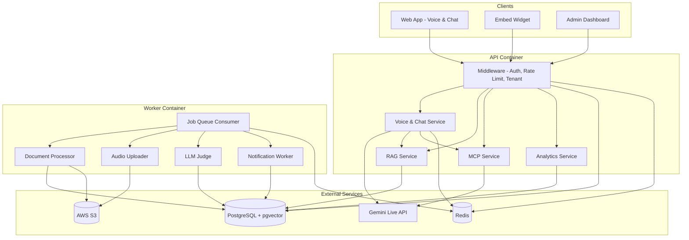
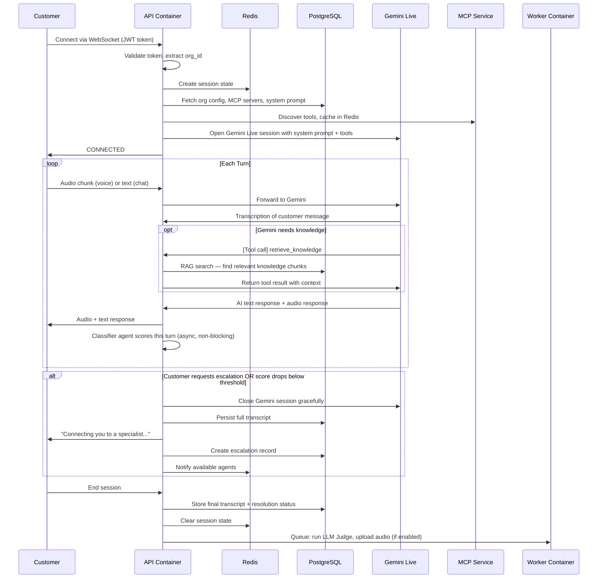
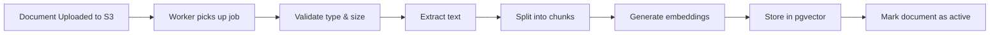
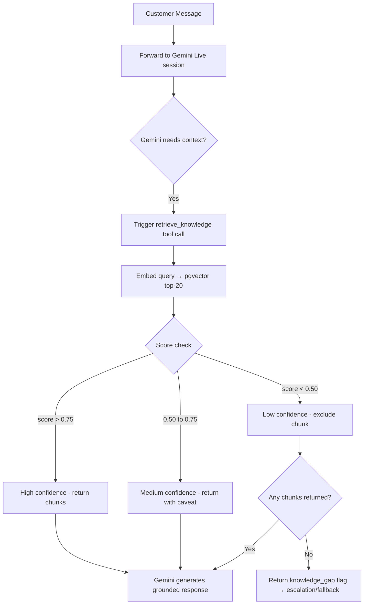
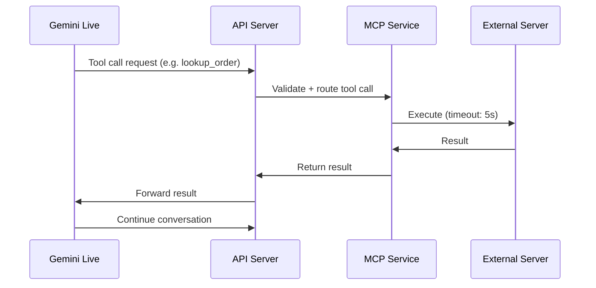
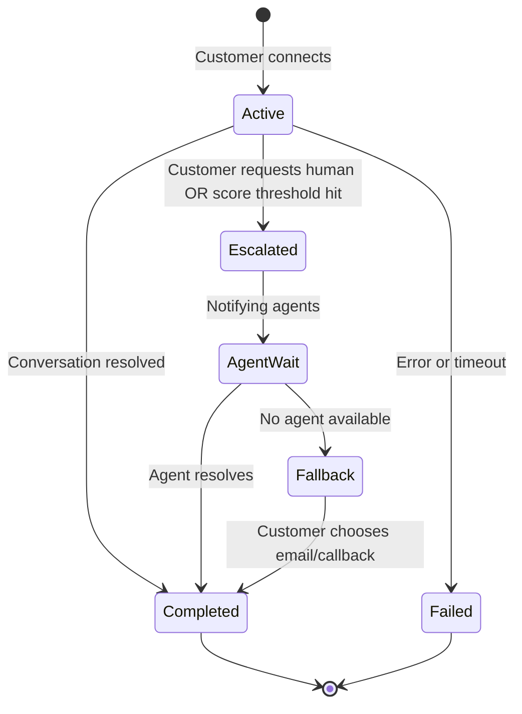
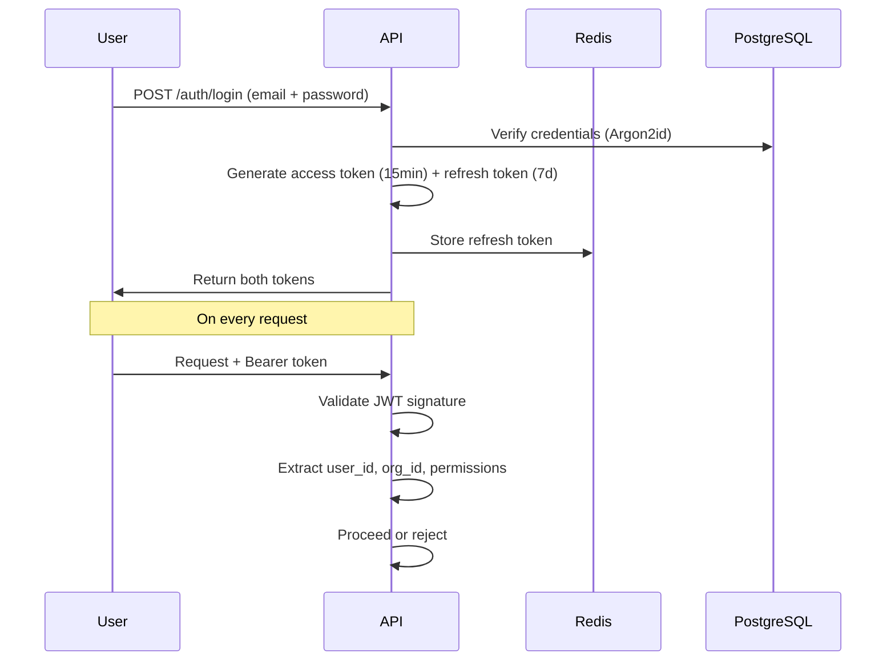
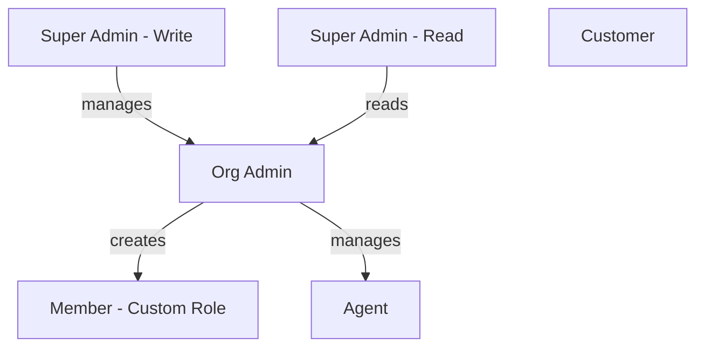
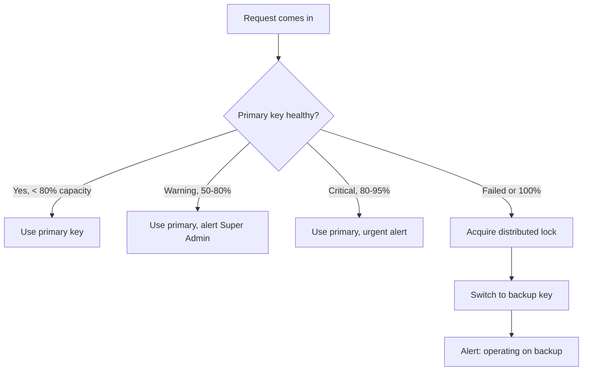
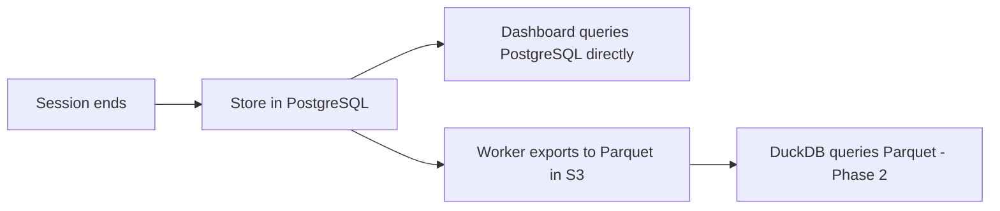

# Voice AI Customer Support Platform — Technical Requirements Document

**Version:** 1.4
**Author:** Sreyash Reddy (IAmCyphr)
**Last Updated:** 2026-05-28
**Status:** InReview

---

## Table of Contents

1. [What We're Building](#1-what-were-building)
2. [System Architecture](#2-system-architecture)
3. [End-to-End Conversation Flow](#3-end-to-end-conversation-flow)
4. [Voice & Chat Pipeline](#4-voice--chat-pipeline)
5. [RAG Pipeline](#5-rag-pipeline)
6. [MCP Integration](#6-mcp-integration)
7. [Session Management](#7-session-management)
8. [Authentication & Roles](#8-authentication--roles)
9. [Data Design](#9-data-design)
10. [Worker Jobs](#10-worker-jobs)
11. [Multi-Tenant Isolation](#11-multi-tenant-isolation)
12. [Error Handling & Resilience](#12-error-handling--resilience)
13. [WebSocket Error Schema](#13-websocket-error-schema)
14. [Credit & Billing Management](#14-credit--billing-management)
15. [Notifications](#15-notifications)
16. [Analytics & Logging](#16-analytics--logging)
17. [Real-Time Conversation Scoring](#17-real-time-conversation-scoring)
18. [System Prompt Generation](#18-system-prompt-generation)
19. [Infrastructure & Deployment](#19-infrastructure--deployment)
20. [Non-Functional Requirements](#20-non-functional-requirements)
21. [Open Decisions](#21-open-decisions)

---

## 1. What We're Building

A platform that lets businesses offer AI-powered voice and chat support to their customers. Businesses upload their knowledge base, configure the AI, and their customers get instant support — no human needed most of the time.

The platform handles everything: real-time voice conversations, knowledge retrieval, tool integrations, escalation to human agents, and feedback loops to keep improving the AI over time.

**Core loop:**

1. Business uploads docs, FAQs, connects their tools
2. Customer starts a voice or chat session on the business's subdomain
3. AI responds using the business's knowledge base and tools
4. If the AI can't help, it escalates to a human agent
5. After every conversation, an LLM Judge reviews quality and surfaces knowledge gaps back to the business

**Target:** 80–90% of conversations resolved by AI without human intervention.

**In scope for MVP:**

- Voice and chat support via web app and embeddable widget
- Multi-tenant architecture (each business is isolated)
- RAG-based knowledge retrieval
- MCP tool integration (platform-provided tools)
- Human escalation (live and async)
- LLM Judge feedback loop
- Analytics dashboard
- Role-based access control

**Out of scope (v0.2+):** Mobile app, URL scraping, business-provided MCP servers, SSO, custom domains.

---

## 2. System Architecture

The entire platform runs as a **Go monolith** — one application, cleanly organized internally. It deploys as two containers plus three external services.

### 2.1 The Two Containers

**`api` container**
The main application. Handles everything that needs to happen in real-time:
- Incoming HTTP requests (REST API)
- WebSocket connections for live voice/chat sessions
- Auth validation, rate limiting, tenant isolation
- Proxying audio and messages to/from Gemini Live API
- Triggering background jobs when needed

**`worker` container**
Runs the same Go binary but in worker mode. Handles everything that can happen in the background:
- Processing uploaded documents (chunking, embedding, indexing)
- Uploading session audio to S3
- Running the LLM Judge on completed conversations
- Sending notifications
- Exporting analytics to Parquet

The two containers share the same codebase. The `api` drops jobs into a queue; the `worker` picks them up and processes them.

### 2.2 External Services

**PostgreSQL (with pgvector extension)**
The primary database. Stores everything permanent: users, organizations, sessions, transcripts, document metadata, embeddings. pgvector handles semantic search directly inside PostgreSQL — no separate vector database needed.

**Redis**
Fast in-memory store for everything temporary and real-time: active session state, conversation history during a call, MCP tool cache, rate limit counters, refresh tokens, job queue.

**Sync strategy:** Text transcripts are mirrored to Redis during a live session and persisted to PostgreSQL at session end. The RAG pipeline reads from Redis for current-turn context so vector search can include prior conversation turns even before they reach PostgreSQL.

**S3-Compatible Storage**
Stores binary files: uploaded documents, session audio (optional, async), analytics exports. We use S3 path prefixes per org to keep data isolated.

### 2.3 High-Level Architecture



### 2.4 Tech Stack

| Component | Technology |
|-----------|------------|
| Language | Go |
| Web Framework | Fiber or Gin + gorilla/websocket |
| Primary Database | PostgreSQL with pgvector |
| Cache & Sessions | Redis |
| Document Storage | AWS S3 |
| Voice AI | Gemini Live API (`google.golang.org/genai`) |
| Tool Integration | MCP (Model Context Protocol) |
| Deployment | Docker + Kamal |

---

## 3. End-to-End Conversation Flow

This is the spine of the entire platform. Everything else in this document is a deep dive into one part of this flow.

### 3.1 The Full Flow



### 3.2 What Happens at Session Start

Before the customer says a single word, we do setup work in under 2 seconds:

1. Validate the JWT and identify which org this customer belongs to
2. Create a session record in PostgreSQL and a session state in Redis
3. Fetch the org's configuration: system prompt, escalation settings, MCP servers
4. Load cached platform MCP tools from Redis (pre-warmed on startup)
5. Connect to any org-specific MCP servers, discover their tools
6. Build the full system prompt: base instructions + org greeting + available tools
7. Open a Gemini Live session with that system prompt
8. Send `CONNECTED` to the customer's browser

### 3.3 What Happens Each Turn

On every customer message:

1. Audio/text arrives from the customer's browser
2. We forward it to the Gemini Live session
3. If Gemini needs knowledge, it triggers a `retrieve_knowledge` tool call (sequential — see Section 5.3 for the full flow)
4. We run the classifier agent to score this turn's quality (parallel, non-blocking)
5. Gemini returns: customer transcription + AI response text + AI audio
6. We send audio + text back to the customer
7. We update conversation history in Redis (mirrored to PostgreSQL at session end — see Section 2.2)

### 3.4 What Happens at Session End

When the conversation ends (customer leaves, escalates, or session times out):

1. Gemini Live session is closed gracefully
2. Full transcript written to PostgreSQL permanently
3. Session state cleared from Redis
4. Worker jobs queued: LLM Judge, audio upload (if org has it enabled)
5. Resolution status recorded: `resolved_ai`, `resolved_human`, `unresolved`, or `unknown`

---

## 4. Voice & Chat Pipeline

This section zooms into the real-time voice/chat part of the flow.

### 4.1 How Voice Works

The customer's browser captures microphone audio. We stream it to our server via WebSocket as raw PCM audio chunks. Our server forwards those chunks to Gemini Live, which handles speech-to-text, LLM reasoning, and text-to-speech all in one streaming session. The audio response comes back and we forward it to the browser.

This is all happening in real-time, bidirectionally. The customer speaks, hears a response within ~500ms.

### 4.2 Audio Specifications

| Parameter | Value |
|-----------|-------|
| Format | PCM 16-bit |
| Sample Rate | 16,000 Hz input; 24kHz from Gemini (resampled to 16kHz for storage) |
| Channels | Mono |
| Chunk Duration | ~32ms (512 samples) |
| Max Chunk Size | 2KB (larger chunks rejected) |

### 4.3 What Gemini Returns Per Turn

For every turn, Gemini Live sends back through the WebSocket stream:

- **Customer transcription** — text of what the customer said
- **AI text response** — what the AI decided to say
- **AI audio response** — spoken version of the response

All three are captured. Text goes into conversation history. Audio goes to the customer's speaker and optionally to temp disk for later S3 upload.

### 4.4 Session States

The customer's UI reflects the current state of the conversation:

| State | Meaning |
|-------|---------|
| `connecting` | Session initializing |
| `listening` | Capturing customer speech |
| `thinking` | AI processing, RAG searching, tools running |
| `speaking` | AI responding |
| `interrupted` | Customer interrupted AI mid-response |
| `escalating` | Transferring to human agent |
| `ended` | Session complete |

### 4.5 Interruption Handling

If the customer speaks while the AI is responding:

1. Client sends `{ type: "interrupt" }`
2. Server clears pending audio buffer
3. Server signals Gemini to stop generating
4. Session state moves to `listening`
5. Customer's new input is processed

### 4.6 Context Window Management

Gemini Live supports a very large context window (1M+ tokens). The practical constraint is not the window size — it is **token accumulation cost and latency** as the conversation grows. To manage this:

- We track a **rolling token count** in Redis per session (using a lightweight tokenizer). Compression is triggered once the sliding window exceeds a configured threshold (default: 50,000 tokens — adjustable per org)
- When the threshold is hit, older turns are compressed and summarized into a concise history summary
- Key entities (order IDs, account numbers, ticket numbers) are preserved explicitly in session state — never discarded
- System prompt is always retained
- Token count is stored in Redis as: `session:{session_id}:token_count` — updated on every turn, reset on compression

### 4.7 WebSocket Keepalive

To detect dead connections:

- Server sends a **ping** every 30 seconds
- Client must respond with **pong** within 10 seconds
- No pong = connection assumed dead, session marked as failed

### 4.8 Session Resumption

If the WebSocket drops unexpectedly:

1. Client reconnects with the same session ID
2. Server validates session is still alive in Redis
3. Server rebuilds Gemini config with conversation history
4. Server sends `RESUMED` state to client
5. Conversation continues

If disconnected for more than 30 seconds, the session is ended gracefully.

---

## 5. RAG Pipeline

RAG (Retrieval-Augmented Generation) is how the AI answers questions using the business's actual knowledge base rather than making things up.

### 5.1 Document Ingestion

When an org uploads a document, the worker container processes it:



Supported file types: PDF, DOCX, TXT, MD, HTML.

### 5.2 Chunking Strategy

| Parameter | Value | Why |
|-----------|-------|-----|
| Chunk size | 512 tokens | Optimal for semantic search |
| Chunk overlap | 64 tokens | Prevents losing meaning at boundaries |
| Method | Sentence-aware splitting | Never cut mid-sentence |
| Min chunk size | 100 tokens | Discard noise |
| Max chunk size | 1024 tokens | Split oversized chunks |

### 5.3 Retrieval Flow

RAG context is injected into the Gemini Live session via **Tool Calling (Function Calling)** — not mid-stream prompt injection. On each customer turn:

1. Customer message arrives → forwarded to Gemini Live session
2. Gemini processes and, if it needs knowledge, triggers a `retrieve_knowledge` tool call
3. Our server executes the vector search in pgvector (top 20 chunks, scored)
4. Chunks above threshold (see 5.4) are returned to Gemini as a tool result
5. Gemini uses the returned context to generate a grounded response
6. If all chunks score < 0.50, we return a `knowledge_gap` flag and Gemini responds with a graceful fallback or escalation



**Note:** RAG cannot be injected mid-stream into an active audio stream. Tool Calling is the native mechanism — it happens before Gemini generates its response, adding typically 200–500ms to the turn latency (within the < 2s target).

### 5.4 Relevance Thresholds

| Score | Action |
|-------|--------|
| > 0.75 | Include — confident answer |
| 0.50–0.75 | Include — AI should express some uncertainty |
| < 0.50 | Exclude — not relevant enough |
| All chunks < 0.50 | Flag as knowledge gap, escalate or return fallback |

---

## 6. MCP Integration

MCP (Model Context Protocol) is how the AI calls external tools — things like looking up an order, creating a support ticket, or checking account status.

### 6.1 Two Types of MCP Servers

**Platform MCP Servers**
Provided by us, available to all orgs. Pre-warmed on startup, tool definitions cached in Redis for 30 minutes. Examples: generic order lookup, create ticket, flag knowledge gap.

**Org MCP Servers**
Configured by each organization to connect to their own systems (CRM, ERP, etc.). Connected on-demand when a session starts. Credentials encrypted with AES-256-GCM.

### 6.2 Tool Call Flow



If a tool call fails or times out, the conversation continues using RAG-only. The failure is logged and the customer is not left hanging.

### 6.3 Timeouts & Retries

| Scenario | Timeout | Retry |
|----------|---------|-------|
| MCP request | 5 seconds | 2 retries, exponential backoff (1s, 2s) |
| Response > 1MB | Reject immediately | None |
| MCP server unreachable | Fail fast | Continue without tools |

### 6.4 Security

| Control | Detail |
|---------|--------|
| Transport | TLS 1.3 mandatory |
| API keys | Passed via header, never in URL |
| Credentials | AES-256-GCM encrypted at rest |
| Request size | Max 64KB request, 1MB response |
| Input validation | Strict JSON schema validation before execution |
| DNS rebinding | Re-resolve on every connection, reject redirects |

---

## 7. Session Management

### 7.1 Session Lifecycle



### 7.2 What's Stored in Redis During a Session

Redis holds the active session state for fast access during a live conversation:

- Session ID, org ID, user ID
- Mode (voice or chat)
- Current status
- Conversation history (active turns within current token threshold — see Section 4.6)
- Retrieved RAG chunks for this session
- MCP tool call results
- Preserved entities (order IDs, account numbers, etc.)
- Session metadata (language, voice name)

TTL: 30 minutes, refreshed on every customer message.

### 7.3 Escalation Flow

Escalation triggers when:
- Customer explicitly asks for a human
- AI confidence drops below threshold after retries
- MCP tool fails repeatedly
- Classifier agent score drops below org-configured threshold (see conversation scoring)

When escalation triggers:

1. AI says: *"Let me connect you with a support specialist."*
2. Gemini Live session is closed gracefully
3. Full transcript persisted to PostgreSQL immediately
4. Escalation record created with full context and classifier signals
5. Available agents notified via configured channels
6. If no agent available: customer sees wait time estimate + options (email, message, callback)
7. When agent accepts: they see full transcript, classifier signals, and session summary

### 7.4 Session TTL Policy

| Event | TTL |
|-------|-----|
| Session created | 30 minutes |
| Customer sends message | Reset to 30 minutes |
| AI responds | No reset |
| Session ends normally | Delete after 1 hour |
| Session failed or escalated | Delete after 24 hours |

### 7.5 Audio Storage

Audio is **not** streamed to storage during the conversation — that would add latency. Instead:

- Audio chunks are buffered in a **non-blocking async goroutine** within the `api` container (a worker pool, not the WebSocket handling goroutine) and written to local temp disk: `/tmp/sessions/{session_id}/audio.pcm`
- File descriptor is held open and chunks are appended sequentially per session; the goroutine does not block the main WebSocket event loop
- After session ends, the `audio_upload` worker job reads the temp file and uploads to S3: `orgs/{org_id}/sessions/{session_id}/audio.pcm`
- Temp file is deleted after successful upload
- Auto-deleted from S3 after 30 days (configurable per org)
- Audio storage is optional — orgs can disable it entirely

Redis only stores audio **metadata** (file size, path, duration), never the actual audio bytes.

---

## 8. Authentication & Roles

### 8.1 Authentication

We use JWT-based authentication. Access tokens expire in 15 minutes. Refresh tokens last 7 days and are stored server-side in Redis (so we can revoke them).



**Password hashing:** Argon2id — 64MB memory, 3 iterations, 4 parallelism. Max password length: 128 bytes.

**JWT payload contains:**
- `sub` — user ID
- `org_id` — organization ID
- `role` — base role
- `permissions` — array of permission strings
- `exp` / `iat` — expiry and issued-at timestamps

### 8.2 Role Hierarchy



| Role | Level | What they can do |
|------|-------|-----------------|
| Super Admin (Write) | Platform | Full access to all orgs, system settings, billing |
| Super Admin (Read) | Platform | Read-only access to all orgs |
| Admin | Org | Full access within their org, create custom roles |
| Agent | Org | Handle escalations, view conversations |
| Member | Org | Custom permissions set by Admin |
| Customer | - | Voice/chat only, no dashboard access |

### 8.3 Permissions

Admins can create custom roles with granular permission toggles:

| Category | Permissions |
|----------|-------------|
| Documents | `docs:read`, `docs:write`, `docs:delete`, `docs:metadata` |
| Knowledge Base | `kb:configure`, `kb:chunks`, `kb:analytics` |
| AI / Voice | `ai:behavior`, `ai:mcp`, `ai:escalation`, `ai:prompts` |
| Team | `team:invite`, `team:permissions`, `team:remove`, `team:activity` |
| Conversations | `conv:view`, `conv:monitor`, `conv:takeover` |
| Analytics | `analytics:view`, `analytics:export` |
| Settings | `settings:profile`, `settings:billing`, `settings:webhooks` |

### 8.4 System Prompt Generation

When an org sets up their AI, they choose one of three modes:

| Mode | How it works |
|------|-------------|
| **Auto-generate** | We run a lightweight LLM call against the org's uploaded documents and generate a system prompt automatically |
| **Auto + Edit** | Same as auto-generate, but the admin can review and customize the result |
| **Custom** | Admin writes the system prompt from scratch |

The generated/saved system prompt is stored per org and injected at session initialization.

---

## 9. Data Design

We use **PostgreSQL** as the single source of truth for all persistent data. pgvector is an extension on the same PostgreSQL instance — no separate vector database.

### 9.1 Tables Overview

**`organizations`**
One row per business using the platform. Stores name, slug (used for subdomain), status, and a JSONB settings blob (system prompt config, escalation settings, feature flags, etc.).

**`users`**
Everyone who has a login: org admins, agents, members, and customers. Each user belongs to one org. Stores email, hashed password, base role, and optional custom role reference.

**`custom_roles`**
Org-created roles with specific permission sets. Stored as a JSONB permissions object. One org can have many custom roles.

**`sessions`**
One row per conversation. Records which org, which customer, voice or chat mode, status, resolution outcome, satisfaction score, and escalation reason if applicable.

**`conversations`**
The transcript — one row per message turn. Records who said it (customer, AI, or agent), the content, any tool calls made during that turn, and a turn index for ordering.

**`documents`**
Metadata about uploaded files. Actual files live in S3. Tracks file type, size, processing status, chunk count, and who uploaded it.

**`document_embeddings`**
The vector representations of document chunks. One row per chunk. Stores the chunk text, its embedding vector (768 dimensions), and a reference back to its parent document. This is what pgvector searches.

**`mcp_servers`**
MCP server configurations per org. Stores URL, auth type, encrypted credentials, connection status, and cached tool definitions.

**`notifications`**
In-app notifications for admins and agents. Tracks read/unread status.

**`audit_logs`**
Immutable log of all admin actions: who did what, when, on which resource. 1-year retention.

**`api_key_pool`**
Platform-level Gemini API keys. Tracks status, usage (RPM, TPM, concurrent sessions), and pool assignment.

### 9.2 S3 Path Structure

```
s3://bucket/
└── orgs/
    └── {org_id}/
        ├── documents/
        │   └── {document_id}/
        │       └── original.{ext}
        ├── sessions/
        │   └── {session_id}/
        │       └── audio.pcm          ← optional, async upload
        └── exports/
            └── {date}/
                └── analytics.parquet  ← Phase 2
```

### 9.3 Redis Key Structure

| Key Pattern | Type | TTL | Stores |
|-------------|------|-----|--------|
| `session:{id}` | Hash | 30 min | Full session state |
| `session:{id}:history` | List | 60 min | Conversation turns |
| `ratelimit:org:{org_id}` | String | 60 sec | Request counter |
| `mcp:tools:{server_id}` | String (JSON) | 5 min | Tool definitions |
| `mcp:platform:tools` | String (JSON) | 30 min | Platform tool definitions |
| `apikey:global:pool` | Sorted Set | Persistent | Key pool state |
| `notifications:unread:{user_id}` | String | — | Unread count |

---

## 10. Worker Jobs

The worker container runs background jobs that the API container queues. Jobs are picked up from a Redis-backed queue.

### 10.1 Job Types

**Document Processing**
Triggered when an org uploads a document. Extracts text, splits into chunks, generates embeddings, stores in pgvector, marks document as active. Updates org on completion via in-app notification.

**Audio Upload**
Triggered when a session ends (if org has audio enabled). Reads the temp audio file from `/tmp/sessions/{session_id}/audio.pcm`, uploads to S3, deletes the temp file, updates the session record with the S3 URL. Auto-deletes from S3 after 30 days unless configured otherwise.

**LLM Judge**
Triggered after every completed session. Reviews the full conversation transcript, scores quality, identifies knowledge gaps, and writes actionable feedback to the org's dashboard. Uses a lightweight model at temperature 0.

**Notification Dispatch**
Triggered by various events (escalation, credit warning, document processed, etc.). Sends notifications via configured channels: in-app, email, SMS, Slack/Teams webhook.

**Analytics Export** *(Phase 2)*
Exports completed session data to Parquet files in S3 for DuckDB analytical queries.

### 10.2 Job Queue

Jobs are stored in Redis as a list. The API container pushes jobs; the worker container pops and processes them. Failed jobs are retried up to 3 times with exponential backoff, then moved to a dead letter queue and an alert is sent to Super Admin.

---

## 11. Multi-Tenant Isolation

Every organization's data is strictly isolated. An org cannot access another org's data under any circumstances.

### 11.1 How It Works

Every database row has an `org_id`. Every API request carries an `org_id` in the JWT. Middleware validates that the `org_id` in the token matches the resource being accessed before any query runs.

This is enforced at four layers:

| Layer | How |
|-------|-----|
| **API Middleware** | Extracts org_id from JWT, injects into request context |
| **Database Queries** | All queries include `WHERE org_id = ?` — no exceptions |
| **Vector Search** | pgvector queries always scoped by org_id |
| **S3 Paths** | Constructed server-side with org_id prefix — user input never touches the path |
| **Redis Keys** | All keys prefixed with org_id |

### 11.2 Threat Mitigations

| Threat | Mitigation |
|--------|-----------|
| Forged JWT with different org_id | Validate JWT signature; org_id claim must match |
| SQL injection | Parameterized queries everywhere |
| Vector DB collision | pgvector always scoped by org_id in WHERE clause |
| S3 path traversal | Paths constructed server-side only |
| Redis key collision | All keys namespaced with org_id |
| MCP credential leak | Credentials scoped and encrypted per org |

---

## 12. Error Handling & Resilience

### 12.1 Retry + Backoff

All external calls (Gemini, MCP, S3) retry on failure:

| Attempt | Delay |
|---------|-------|
| 1st retry | 1 second |
| 2nd retry | 2 seconds |
| 3rd retry | 4 seconds |
| After 3 failures | Circuit breaker trips |

### 12.2 Circuit Breaker

| State | Condition | Behavior |
|-------|-----------|----------|
| Closed | < 5 failures | Normal operation |
| Open | 5 failures in 30s | Fail fast, return fallback immediately |
| Half-open | 30s after opening | Allow 1 test request through |

### 12.3 Graceful Degradation

If a service is unavailable, the platform degrades gracefully rather than failing completely:

| Scenario | What Happens |
|----------|-------------|
| RAG unavailable | AI continues with general knowledge, flags knowledge gap |
| MCP tools unavailable | AI continues with RAG only |
| Gemini unavailable | "Technical difficulties" message, escalate to human |
| All services down | Immediate escalation to human or fallback message |

### 12.4 API Key Pool Failover

We manage a pool of Gemini API keys to handle rate limits and failures:



Keys are tracked per: RPM (requests per minute), TPM (tokens per minute), and concurrent sessions. Dynamic round-robin skips keys approaching their limits.

### 12.5 Connection Recovery

| Drop Duration | Action |
|--------------|--------|
| < 5 seconds | Auto-reconnect, context preserved |
| 5–30 seconds | Show "reconnecting" UI, retry 3 times |
| > 30 seconds | End session gracefully |
| > 2 minutes | Mark for review, notify admin |

---

## 13. WebSocket Error Schema

When the server must send an error over the WebSocket connection, it uses this schema:

```json
{
  "type": "error",
  "code": "rate_limit" | "timeout" | "service_unavailable" | "payload_too_large" | "auth_failed" | "session_not_found",
  "message": "Human-readable description of what went wrong",
  "requestId": "req_abc123",
  "retryAfterMs": 5000
}
```

| Code | When | Action |
|------|------|--------|
| `rate_limit` | Session or org over limits | `retryAfterMs` set to backoff window |
| `timeout` | RAG or MCP call exceeded deadline | Retry up to 3 times with exponential backoff |
| `service_unavailable` | Backend service (Redis, PG, Gemini) is down | `retryAfterMs` = 30s, fallback to graceful degradation |
| `payload_too_large` | Audio chunk exceeds max size | Client must chunk before sending |
| `auth_failed` | JWT invalid or expired | Client must re-authenticate |
| `session_not_found` | Session ID not in Redis | Client must start a new session |

---

## 14. Credit & Billing Management

### 14.1 API Key Pool Architecture

The platform manages a pool of Gemini API keys shared across all organizations. This avoids per-org quota limits and allows centralized rate management.

**Security:** All platform API keys stored in `settings.api_key_pools` are encrypted at rest using **AES-256-GCM**. The encryption key is injected at runtime via environment variable (`API_KEYS_ENCRYPTION_KEY`) — never stored in the database. If the database is compromised without the key, the keys remain unreadable.

```
+--------------------------------------------------------------------------+
|                        API KEY POOL MANAGER                              |
|                                                                           |
|   +---------------------------------------------------------------------+ |
|   |  Key Allocation                                                      | |
|   |                                                                      | |
|   |   +----------+  +----------+  +----------+  +----------+           | |
|   |   |  Key A   |  |  Key B   |  |  Key C   |  |  Key D   |           | |
|   |   |  (Pool)  |  |  (Pool)  |  |  (Pool)  |  | (Backup) |           | |
|   |   +----------+  +----------+  +----------+  +----------+           | |
|   +---------------------------------------------------------------------+ |
|                                                                           |
|   +---------------------------------------------------------------------+ |
|   |  Load Distribution                                                     | |
|   |   Dynamic round-robin across healthy keys                            | |
|   |   Skip keys approaching rate limit                                    | |
|   |   Monitor: RPM | TPM | Concurrent Sessions                            | |
|   +---------------------------------------------------------------------+ |
|                                                                           |
|   +---------------------------------------------------------------------+ |
|   |  Alert Thresholds                                                     | |
|   |   > 50% used  -> Warning to Super Admin                             | |
|   |   > 80% used  -> Urgent alert to Super Admin                        | |
|   |   ~100% used  -> Failover to backup key                            | |
|   +---------------------------------------------------------------------+ |
+--------------------------------------------------------------------------+
```

### 14.2 Key Pool Configuration

| Pool | API Key | Orgs | Purpose |
|------|---------|------|---------|
| Default | Key A | All | Primary traffic |
| Overflow | Key B, Key C | All | Handle burst |
| Backup | Key D | All | Failover when pool exhausted |

Pool configuration stored in `settings.api_key_pools` in PostgreSQL.

### 14.3 RPM / TPM Tracking

Each key tracks:

| Metric | Limit | Behavior at threshold |
|--------|-------|----------------------|
| RPM (requests/min) | 60 (default, configurable per key) | Route to next key |
| TPM (tokens/min) | 1M (default) | Route to next key |
| Concurrent sessions | 50 (default) | Queue or route to next key |

Tracking via Redis sorted set with sliding window:

```
Key: apikey:global:pool
Type: Sorted Set
Members: key_id
Scores: last_used_timestamp
```

### 14.4 Alert Thresholds

| Utilization | Action |
|-------------|--------|
| > 50% | In-app warning to Super Admin |
| > 80% | Urgent alert + email to Super Admin |
| ~100% | Failover to backup key + page Super Admin |
| Backup key also exhausted | Block new sessions, notify all Super Admins |

### 14.5 Failover Behavior

When primary key fails or hits limit:

1. Acquire distributed lock: `lock:apikey:switch`
2. Mark failed key as `degraded` in pool state
3. Route new requests to next healthy key
4. Release lock
5. Alert Super Admin

Failed key automatically retried after 60 seconds. If it recovers, it rejoins the pool.

### 14.6 Cost Tracking

Per-session token usage is tracked and stored:

```sql
CREATE TABLE session_costs (
    id UUID PRIMARY KEY DEFAULT gen_random_uuid(),
    session_id UUID NOT NULL REFERENCES sessions(id) ON DELETE CASCADE,
    org_id UUID NOT NULL REFERENCES organizations(id) ON DELETE CASCADE,
    input_tokens INT NOT NULL,
    output_tokens INT NOT NULL,
    cost_usd DECIMAL(10, 6) NOT NULL,
    recorded_at TIMESTAMP WITH TIME ZONE DEFAULT NOW()
);
```

Cost = `(input_tokens × $0.000075/1k) + (output_tokens × $0.0003/1k)` (Gemini 2.0 Flash pricing, approximate).

---

## 15. Notifications

### 15.1 Notification Types

| Event | Who Gets Notified | Channels |
|-------|------------------|---------|
| Credit < 50% | Super Admin | In-app, Email |
| Credit < 20% | Super Admin | In-app, Email, SMS |
| Credit < 5% | Super Admin | In-app, Email, SMS (urgent) |
| API key pool warning | Super Admin | In-app |
| API key failure | Super Admin | In-app, Email |
| MCP server down | Org Admin | In-app, Email |
| Escalation threshold hit | Org Admin | In-app, Email |
| Document processed | Org Admin | In-app |
| System unhealthy | Super Admin | In-app, Email |

### 15.2 Channels

| Channel | Configurable | Notes |
|---------|-------------|-------|
| In-app | Always on | Unread badge counter |
| Email | Yes — on/off, digest frequency | |
| SMS | Yes — critical only | |
| Slack / Teams | Yes — webhook URL | |

---

## 16. Analytics & Logging

### 16.1 Metrics We Track

| Category | What |
|----------|------|
| Volume | Total calls/chats, daily/weekly/monthly |
| Escalation | % escalated, reasons, resolution status |
| AI Performance | Answer success rate, struggle topics, RAG hit rate |
| Knowledge Gaps | Unanswered questions flagged by LLM Judge |
| Satisfaction | Ratings (1–5), implicit resolution (callback within 24h) |
| Usage | Peak hours, failed queries, topic breakdown, token spend per org |

### 16.2 Resolution Tracking

| Status | Meaning |
|--------|---------|
| `resolved_ai` | AI handled it, customer satisfied |
| `resolved_human` | Escalated, human resolved it |
| `unresolved` | Escalated, issue not resolved |
| `unknown` | Session ended without clear outcome |

**Implicit resolution rule:** If the same customer contacts support about the same issue within 24 hours, the original session is marked `unresolved`.

### 16.3 Analytics Flow

For MVP, analytics queries run directly on PostgreSQL. Phase 2 adds DuckDB for complex analytical queries on Parquet exports.



### 16.4 Log Retention

| Log Type | What | Retention |
|----------|------|-----------|
| API logs | All requests, response times, org_id | 30 days |
| Session logs | Events, errors, tool calls | 90 days |
| Audit logs | Admin actions, changes | 1 year |
| Error logs | Exceptions, stack traces | 30 days |

---

## 17. Real-Time Conversation Scoring

### 17.1 Overview

Every turn during a live customer conversation, a lightweight **Classifier Agent** runs in parallel to the main Gemini Live session. It evaluates the conversation state and outputs a health score (0.0–1.0) that drives live dashboard visibility and human takeover decisions.

**Model:** Gemini 2.0 Flash, temperature 0
**Trigger:** Every conversation turn (customer message + AI response)
**Output:** Score + per-signal breakdown + suggested action, stored in Redis during session

---

### 17.2 Signal Taxonomy

Four independent signals are computed per turn and combined into a single score.

**Confidence & Grounding — Weight 40%**

Measures whether the AI is drawing from actual knowledge or hallucinating.

| Condition | Score |
|-----------|-------|
| RAG chunk score > 0.75 | 1.0 |
| RAG chunk score 0.50–0.75 | 0.7 |
| RAG chunk score < 0.50 | 0.3 |
| No RAG context available | 0.2 |
| AI says "I don't know" / "I can't help" | 0.4 |
| MCP tool call succeeds | +0.15 bonus |
| MCP tool call fails | −0.20 penalty |

**Customer Sentiment & Frustration — Weight 35%**

| Condition | Score |
|-----------|-------|
| Explicit escalation request | 0.0 (immediate override) |
| High frustration markers ("doesn't work," "repeating," "why") | 0.1–0.3 |
| Mild skepticism ("okay but," "I'm not sure," "hmm") | 0.5 |
| Neutral / cooperative ("okay," "got it") | 0.7 |
| Satisfied / positive ("thanks," "perfect," "that helps") | 0.95 |

Score the last two customer messages and average them.

**Progress Toward Resolution — Weight 15%**

| Turn Count | Base Score |
|------------|------------|
| Turn 1–3 | 1.0 |
| Turn 4–5 | 0.8 |
| Turn 6–8 | 0.6 |
| Turn 9–12 | 0.4 |
| Turn 13+ | 0.2 |

**Penalties:** Same question twice (−0.30), AI self-contradiction (−0.20), "I already told you" (−0.40)
**Bonuses:** Follow-up building on prior answer (+0.10), MCP tool returned actionable result (+0.20)

**Knowledge Gap Risk — Weight 10%**

| Condition | Score |
|-----------|-------|
| All RAG chunks < 0.50 | 0.1 |
| MCP tool called but error returned | 0.2 |
| AI responds despite low confidence | 0.3 |
| RAG context found and used | 0.9 |
| Question matches known FAQ / common issue | 0.95 |

---

### 17.3 Overall Score

```
score = (0.40 × confidence) + (0.35 × sentiment) + (0.15 × progress) + (0.10 × kg_risk)
```

Result range: **0.0 – 1.0**

---

### 17.4 Threshold Tiers

Default thresholds — org-configurable per deployment settings.

| Range | Status | Action |
|-------|--------|--------|
| 0.70 – 1.00 | 🟢 Green | Normal. Continue. |
| 0.50 – 0.69 | 🟡 Yellow | Monitor. Flag on dashboard. Optional admin alert. |
| 0.30 – 0.49 | 🟠 Orange | At risk. Dashboard notification. Suggest takeover. |
| 0.00 – 0.29 | 🔴 Red | Critical. Auto-notify admin. Immediate takeover recommended. |

**Org-configurable overrides:**
- Red threshold: 0.2 (permissive) to 0.5 (aggressive)
- Auto-escalate on Red: toggle on/off per org

---

### 17.5 Scoring Flow

```
Customer Message
      ↓
Gemini Live processes turn
      ↓
Classifier Agent runs (parallel, async)
      ↓
Score computed → stored in Redis as: session:{session_id}:score
      ↓
Dashboard polls / receives push update
      ↓
If score < threshold: Flag conversation + notify admin + log suggested action
```

**Redis key during session:**

```
Key: session:{session_id}:score
Type: Hash
TTL: 30 minutes
Fields: overall_score, confidence, sentiment, progress, kg_risk, tier, suggested_action, updated_at
```

Post-session, worker persists final score to `conversation_scores` table.

---

### 17.6 Dashboard Real-Time View

Live conversations panel shows per-conversation:

| Field | Description |
|-------|-------------|
| Session ID | Unique identifier |
| Customer | Identifier if provided by org |
| Mode | Voice / Chat |
| Turn Count | Current turn number |
| Current Score | 0.0–1.0 with color indicator |
| Score Trend | Arrow: improving / stable / declining |
| Top Signal | Which signal is lowest right now |
| Status | Active / Flagged / Takeover Pending |

Admins can click any row to see full live transcript + per-signal breakdown in real time.

---

### 17.7 Human Takeover Flow

1. **Admin sees flagged conversation** — current score, which signal tanked, last 3 turns preview, suggested reason
2. **Admin clicks "Take Over"**
3. **System:** Pauses Gemini Live gracefully → persists full transcript → bundles classifier signals for agent
4. **Customer hears:** "Thanks for your patience. A support specialist has reviewed our conversation and would like to help. One moment please..."
5. **Human agent receives:** Full transcript (read-only), per-signal score breakdown, flagged reason, session duration + turn count, knowledge gaps or failed tool calls
6. **Agent resolves** → `resolved_human` or → escalated

---

## 18. System Prompt Generation

### 18.1 Overview

The system prompt is the base instruction injected into every Gemini Live session. It defines how the AI behaves, what tone it uses, and what constraints it follows.

Three modes, configurable per org:

| Mode | Description |
|------|-------------|
| **Auto-generate** | Lightweight LLM call against org's documents → generates tailored prompt automatically |
| **Auto + Edit** | Same as auto-generate, admin reviews and customizes before activation |
| **Custom** | Admin writes the system prompt from scratch |

---

### 18.2 Generation Model

**Gemini 2.0 Flash** at temperature 0.2 (slight creativity, deterministic output).

**Inputs to the generator:**
- All active documents from the org's knowledge base (text content only)
- Org name and industry (from org settings)
- Conversation context examples (if available)
- Custom instructions provided by admin (if mode is Auto + Edit or Custom)

**Output:** Structured system prompt stored per org and injected at session initialization.

---

### 18.3 Storage Schema

```sql
CREATE TABLE system_prompts (
    id         UUID PRIMARY KEY DEFAULT gen_random_uuid(),
    org_id     UUID NOT NULL REFERENCES organizations(id) ON DELETE CASCADE,
    mode       VARCHAR(20) NOT NULL CHECK (mode IN ('auto', 'auto_edit', 'custom')),
    content    TEXT NOT NULL,
    is_active  BOOLEAN DEFAULT FALSE,
    created_at TIMESTAMP WITH TIME ZONE DEFAULT NOW(),
    updated_at TIMESTAMP WITH TIME ZONE DEFAULT NOW()
);

CREATE INDEX idx_prompts_org ON system_prompts(org_id);
CREATE INDEX idx_prompts_active ON system_prompts(org_id, is_active);
```

---

### 18.4 System Prompt Structure

All modes produce a prompt following this structure:

```
[Base Instruction]
You are a professional support agent for [Org Name].

[Behavior Rules]
- Be polite, concise, and helpful
- Use the customer's language
- Never make up information not in the knowledge base
- Escalate when unsure

[Tone & Style]
- Professional but friendly
- Short responses (voice support)
- Long-form responses (chat support)

[Context]
- Knowledge base: [dynamically injected from RAG]
- Available tools: [dynamically injected from MCP]

[Escalation]
- Escalate when: [org-configurable triggers]
```

---

### 18.5 Regeneration Triggers

| Trigger | Action |
|---------|--------|
| New document uploaded | Mark prompt draft for regeneration |
| Document updated | Mark prompt draft for regeneration |
| Document deleted | Mark prompt draft for regeneration |
| Admin requests | Regenerate immediately |
| Weekly schedule | Auto-regenerate if docs changed |

Regeneration is async (worker job). Active sessions use the current prompt until session ends.

---

## 19. Infrastructure & Deployment

### 19.1 Containers

| Container | What It Runs |
|-----------|-------------|
| `api` | Go HTTP + WebSocket server |
| `worker` | Go background job processor |

Both run the same binary. The `worker` container starts in worker mode via an environment variable or CLI flag.

External services (PostgreSQL, Redis, S3) are not containerized by us in production — they run as managed services or dedicated instances.

### 19.2 Deployment

**Docker + Kamal** — self-hosted deployment. Kamal handles zero-downtime deploys, container management, and rollbacks.

### 19.3 Scaling

For MVP, everything runs on a single server. For scale:

| Component | Scale Strategy |
|-----------|---------------|
| `api` container | Stateless — add more instances behind a load balancer |
| `worker` container | Add more instances — they compete for jobs from the queue |
| PostgreSQL | Streaming replication |
| Redis | Sentinel / Cluster mode |
| S3 | Externally managed, scales automatically |

---

## 20. Non-Functional Requirements

### 20.1 Performance

| Metric | Target |
|--------|--------|
| AI response latency | < 2 seconds |
| Voice audio latency | < 500ms (mic to speaker) |
| Session initialization | < 2 seconds |
| Session resumption | < 5 seconds |
| Concurrent sessions | 1,000 per Gemini project |

### 20.2 Availability

| Level | Target |
|-------|--------|
| Platform uptime | 99.9% |
| Max degraded time before escalation | < 1 hour |

### 20.3 Security

| Requirement | Implementation |
|-------------|----------------|
| Encryption at rest | All data encrypted — database, Redis, S3 |
| Encryption in transit | TLS 1.3 |
| Password hashing | Argon2id (64MB, 3 iterations, 4 parallelism) |
| MCP credentials | AES-256-GCM |
| MFA | Required for Super Admin, recommended for Org Admin |
| Audit logging | All admin actions logged |
| JWT algorithm | RS256 |

### 20.4 Scale Targets

| Metric | MVP | Scale |
|--------|-----|-------|
| Concurrent calls | 50 | 500 |
| Organizations | 10 | 100+ |
| Documents per org | 100 | 10,000 |
| Sessions per day | 1,000 | 50,000 |

---

## 21. Open Decisions

| ID | Decision | Status |
|----|----------|--------|
| OD-001 | S3 provider | Locked: AWS S3 |
| OD-002 | Web framework (Fiber vs Gin) | TBD |
| OD-003 | Job queue implementation (Redis list vs dedicated table) | TBD |
| OD-004 | Embedding model for pgvector (affects vector dimensions) | TBD |
| OD-005 | LLM Judge model selection | TBD |
| OD-006 | Strategy for real-time RAG injection into Gemini Live session (Tool Calling vs session mutation) | **Locked: Tool Calling** — Gemini triggers `retrieve_knowledge` tool; server executes pgvector search and returns context before generating response. See Section 5.3. |

---

*Document Status: Draft — Pending Review*
*Reference: PRD at `docs/prd.md`*
